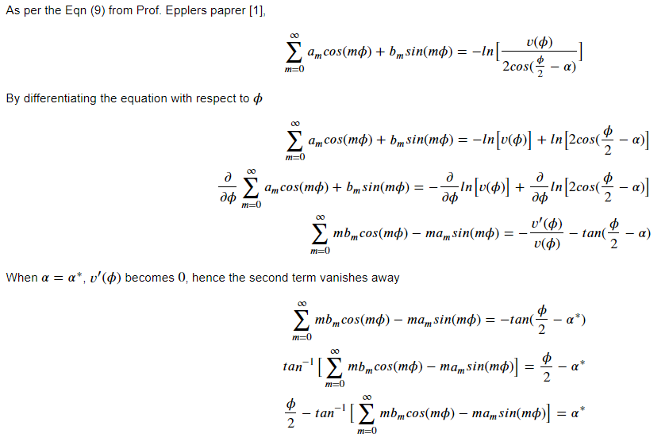
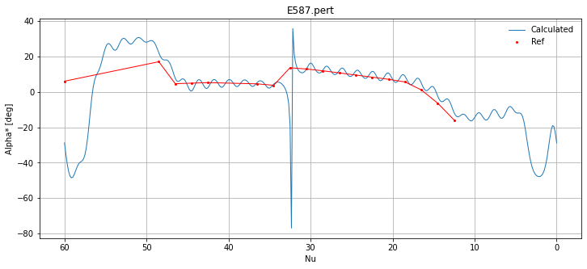

# Redesign
## A program to find α* distribution of a given airfoil using Fourier Coefficients

## Theoritical Derivation



In practice, the Fourier coeifficients that goes in to the program can be generated through **MDES -> Pert** menu in **XFoil**  
This approach generally works on any airfoil, regardless of non-equially spaced phi, camber and thickenss distribution, additional LE points etc, and hence could be considered very flexible. 

## Implementation and Usage

Actual implementation details listed in the Redesign.py file closly follow what is been described above with heavily commented functions.  
As for the usage; this can be run on a notebook as shown below or on any other python REPL.


```python
from redesign import *
import matplotlib.pyplot as plt
plt.rcParams['figure.figsize'] = [12, 5]
```

The input file goes in to the program is a list of Furier coeificients [Cn] from Xfoil. For ex:


```python
!type E587.pert
```

    Current mapping coefficients...
           n    Re(Cn)      Im(Cn)
           1    0.965488    0.000010
           2   -0.239280   -0.165005
           3    0.169885    0.074844
           4   -0.089376   -0.126380
           5    0.026908    0.071984
           6   -0.006093   -0.068958
           7   -0.003830    0.051284
           8    0.017655   -0.039186
           9   -0.023022    0.027256
          10    0.021639   -0.014549
          11   -0.023036    0.011598
          12    0.020121    0.000445
          13   -0.018286   -0.000581
          14    0.012873    0.007967
          15   -0.011405   -0.007255
          16    0.005749    0.010218
          17   -0.004412   -0.008744
          18    0.000150    0.009082
          19    0.000610   -0.007253
          20   -0.003155    0.005568
          21    0.002815   -0.004237
          22   -0.003904    0.002531
          23    0.002926   -0.001188
          24   -0.002814    0.000338
          25    0.001563    0.000104
          26   -0.001159   -0.000292
          27    0.000239    0.000018
          28   -0.000187    0.000420
          29   -0.000069   -0.001027
          30   -0.000404    0.001375
          31    0.000700   -0.001659
          32   -0.001423    0.001543
    


```python
e587_ref =  [[12.5000,-15.92], [14.5000, -6.42], [16.5000,  1.08], [18.5000,  5.58], [20.5000,  7.08], [22.5000,  8.28], 
[24.5000,  9.48], [26.5000, 10.68], [28.5000, 11.88], [30.5000, 12.88], [32.5155, 13.58], [34.5000,  3.70], 
[36.5000,  4.50], [42.5000,  5.20], [44.5000,  4.90], [46.5000,  4.60], [48.5000, 17.00], [60.0000,  6.00]]

r = Redesign("E587.pert", e587_ref)
```


    

    


The above graph shows the calculated $\alpha^*$ destribution of Eppler-587 airfoil.  
Referece line in red shows the actual $\nu - \alpha^*$ destribution which was used to generate the airfoil

## Note

Probably due to the discontiniuety of the harmonic series at the LE, ripples present in the redesigned $\alpha^*$ destribution.  
As per my understanding this cannot easily be overcome given the nature of the $P(\phi)$  
For practical purposes, this should'nt cause too much trouble - a larger phi spacing can be used if required, which mitigates the issue somewhat.  
Any pull request adressing this specific issue is very welcome

## Reference 

[1] Eppler, R., Somers, D.   
A Computer Program for the Design and Analysis of Low Speed Airfoils  
NASA TM-80210, 1980.  
